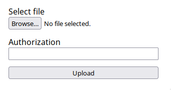
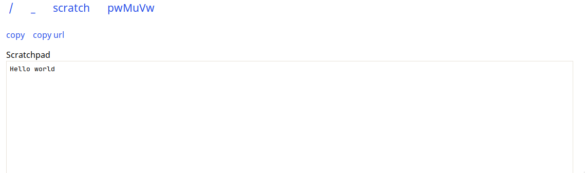

# Filexplorer

A lightweight highly extensible, and highly configurable 
NodeJS web-based file explorer and utility kit.

## Included features

The included plugins provide the following features:

- Directory listings with file/folder information
- Intelligent file type resolving
- Full web interface for viewing files
  - Markdown rendered in browser
  - Syntax highlighting for text files
  - Embedded image, video and audio files
- Ability to serve raw files, and falls back to doing so
- Ability to upload files
- Live scratchpad
- Breadcrumb navigation
- Dark mode
- Non-browser clients are always served raw files

For more information, please read about each of the plugins below.


## Installation

> ⚠️ Note that the package makes use of experimental node features and requires Node >= 18.

### Standalone

Clone this repo and run the following to install dependencies and compile:

```bash
yarn start
yarn build
```

Run using `yarn start`. Alternatively you can start using node directly:

```bash
node --experimental-wasm-modules --experimental-import-meta-resolve lib
```

### NPM Package

Filexplorer can be installed as an NPM package, 
which is useful if you plan to embed it or develop a plugin.

```bash
npm i filexplorer --save
# or
yarn add filexplorer
```

The package also includes a CLI which can be used for impromptu serving:

Note the CLI does not load the `appListing`, `upload`, or `scratchpad` plugins by default.

```
λ fe help
  Usage: fe [options] [command]
  
  Commands:
    help     Display help
  
  Options:
    -H, --help            Output usage information
    -h, --hostname        The host address to bind to
    -P, --plugins         The plugins to load, comma separated list
    -p, --port            The port to bind to
    -s, --serveDirectory  The path to the directory on disk to serve
```

### Docker

A docker image is available and can be run like so:

```bash
docker run \
  -p 5000:5000 \
  -v config.corn:/opt/filexplorer/config.corn \ # Passing a config is optional
  -v data.db:/data.db \ # necessary to persist plugin data
  -v path/to/files:/srv/http \
  jakestanger/filexplorer
```

## Configuration

The app works out of the box without any configuration, 
and by default all plugins are enabled.

To override the default configuration,
create a `config` file using one of the following supported formats:

- `config.js`, `config.mjs`, `config.cjs`
- `config.json`
- `config.yaml`, `config.yml`
- `config.toml`
- `config.corn` (useful for environment variables! see [here](https://github.com/jakestanger/corn#writing-corn))

Plugins may provide their own configuration options, 
which are namespaced under the plugin name.
For example, the `showHidden` option for the `directoryListing` plugin
should be set at `directoryListing.showHidden`.

| Name             | Type     | Default                                                                                                  | Description                                                                                                   |
|------------------|----------|----------------------------------------------------------------------------------------------------------|---------------------------------------------------------------------------------------------------------------|
| `hostname`       | string   | `127.0.0.1`                                                                                              | Host address to listen on                                                                                     |
| `port`           | number   | `5000`                                                                                                   | Port to listen on                                                                                             |
| `cors`           | boolean  | `false`                                                                                                  | Whether to enable CORS support                                                                                |
| `serveDirectory` | string   | `.`                                                                                                      | Path on disk to the directory to serve                                                                        |
| `baseUrl`        | string   | `/`                                                                                                      | URL path to use as 'root'                                                                                     |
| `caseSensitive`  | boolean  | `true`                                                                                                   | Whether file route handling should be case sensitive. Disable on Windows or on case-insensitive file systems. |
| `databasePath`   | string   | `data.db`                                                                                                | Path to create/load database at                                                                               |
| `plugins`        | string[] | `["directoryListing", "appListing", "markdown", "textFile", "mediaFile", "raw", "upload", "scratchpad"]` | List of plugins to load, in the order they should be loaded                                                   |

The following environment variables are also respected and will override the configuration file:

- `HOSTNAME`
- `PORT`
- `SERVE_DIRECTORY`
- `DATABASE_PATH`

### Example

An example config file in yaml is shown below, 
overriding the port, serve directory and `directoryListing` plugin options.

```yaml
port: 5202
serveDirectory: '/srv/http/public'

directoryListing:
  showHidden = true
  relativeDates = false
```

## Included plugins

The following plugins are 

### `directoryListing`

Shows a table of files and folders inside a directory.
Each row has a link to the item, file size, and created/modified dates. 


| Name            | Type    | Default | Description                                                  |
|-----------------|---------|---------|--------------------------------------------------------------|
| `showHidden`    | boolean | `false` | Show hidden files and folders                                |
| `relativeDates` | boolean | `true`  | Display created/modified dates as relative from current time |

### `textFile`

Shows the contents of plain text files in the web interface. 
Provides a link to the raw file (requires `raw`), a direct download, and the ability to copy to clipboard.

The file is syntax highlighted using `highlight.js`.


| Name             | Type    | Default   | Description                                                                                                                            |
|------------------|---------|-----------|----------------------------------------------------------------------------------------------------------------------------------------|
| `highlightTheme` | string  | `default` | The highlight.js theme to use. See [here](https://github.com/highlightjs/highlight.js/tree/main/src/styles) for a list                 |
| `autoHighlight`  | boolean | `false`   | Whether highlight.js should try to automatically detect syntax highlighting if the language could not be determined from the extension |
| `maxHighlightKb` | number  | `50`      | The maximum file size in kB that should be highlighted                                                                                 |
| `handleSvg`      | boolean | `false`   | Whether SVGs should be handled as text                                                                                                 |

### `mediaFile`

Shows the contents of images, videos and audio in the web interface.
Provides a link to the raw file (requires `raw`) and a direct download.


*This plugin provides no configuration options.*

### `markdown`

> ⚠ This plugin must be loaded **before** `textFile`

Renders markdown files in the web interface. Supports GFM and syntax highlighting.


| Name             | Type    | Default   | Description                                                                                                            |
|------------------|---------|-----------|------------------------------------------------------------------------------------------------------------------------|
| `highlight`      | boolean | `true`    | Whether code blocks should be highlighted                                                                              |
| `highlightTheme` | string  | `default` | The highlight.js theme to use. See [here](https://github.com/highlightjs/highlight.js/tree/main/src/styles) for a list |
| `gfm`            | boolean | `true`    | Whether to use Github Flavored Markdown                                                                                |

### `raw`

> ⚠ This plugin must be loaded **after** any other file handling plugins

Serves files statically without the web interface, letting the browser handle them.

If a file's type cannot be determined, the plugin will test if is a text file and force-serve it as one.

*This plugin provides no configuration options.*

### `appListing`

> App URL: `/_/`

Shows a list of available app plugins with the ability to navigate to each one.

*This plugin provides no configuration options.*

### `upload`

> App URL: `/_/upload`

Provides the ability to upload files. This can be done programmatically or via the web interface.
Files are automatically given random names according to a chosen scheme.

For example to upload using `cURL`:
```bash
curl -F "file=@Pictures/Cake.png" -H "Authorization: 1234" http://localhost:5000
```



| Name            | Type                                                | Default | Description                                                                       |
|-----------------|-----------------------------------------------------|---------|-----------------------------------------------------------------------------------|
| `maxFileSize`   | number                                              | `null`  | Maximum allowed file size                                                         |
| `authorization` | string                                              | `null`  | Expected HTTP `Authorization` header value. Leave blank to disable authorization. |
| `path`          | string                                              | `/`     | Path relative to served root to upload files to.                                  |
| `nameScheme`    | `hex \| uuid \| cuid \| adjective-adjective-animal` | `hex`   | Naming scheme to use for generating random names for uploaded files.              |

### `scratchpad`

> App URL: `/_/scratch`
 
Provides a live scratchpad which can be used for quickly sharing text. 
Any client with the same URL will see the same content and will see changes apply near-instantly.

There are controls for instantly copying the scratchpad contents and URL.



*This plugin provides no configuration options.*

### Use as a library

> ⚠ This is very experimental still. Any issues discussing bugs/improvements are very welcome.

```ts
import { App } from 'filexplorer/lib/App.js';

// the promise will not resolve until the server receives a shutdown signal
// you can optionally pass a config
await App.init({ port: 5678 })

// close the server once you're done with it
App.server.close();
```

### Developing plugins

> ⚠ This is very experimental still. Any issues discussing bugs/improvements are very welcome.

Plugins can be loaded from inside this codebase or as a standalone npm package.

A very basic example plugin is shown below:

```ts
import {
  InitEvent,
  MiddlewarePlugin,
  PluginManager,
} from '../../pluginManager.js';

interface IExampleConfig {
  // put your plugin config options here
  greeting: string;
}

// init hooks are called just before the web server starts
// and are useful for configuring any required modules based on the app config
const init: InitEvent<'example', IExampleConfig> = async ({ config }) => {
  // do init things!
  console.log(config.example.greeting ?? 'hello', 'world');
};

// middleware can be used for handling files/directories
// this is just express.js middleware under the hood
const exampleMiddeware: MiddlewarePlugin<'example', IExampleConfig> = async ({ req, res, next }) => {
  res.send('hello from example');
};

// other available features for plugins:
// - `withAppMiddleware`: register middleware on a specific route to create an app
// - `withSocketIO`: passes a socket to a callback when the socket connects
// - `withDatabaseTable`: Ensures a database table exists with the provided schema
PluginManager.register('example').onInit(init).withMiddleware(markdown);
```

Your plugin can be loaded by adding it to the `plugins` config option. More information on this below:

#### Embedded

Create a new folder in `src/plugins` that matches your plugin name. 
This folder *must* contain an `index.ts` (or `.js` or `.mts` or `.mjs`) file.

Handlebars templates should be placed in the `resources/plugins` folder in the root of this repo.

To load an embedded plugin, add the plugin directory name to `plugins` config option.

#### Separate package

Create a new package. If necessary add `filexplorer` as a dev/peer dependency for development.
Ensure your package has a `main` entrypoint set in the `package.json`.

Handlebars templates should be placed in the `resources/plugins` folder in the root of your package.

To load separate-package plugins, add the plugin package name to the `plugins` config option.

### Theming

The app makes use of modern CSS features like custom properties to make theming as easy as possible.
To make global CSS changes, apply these in `public/index.css`. 
For plugin-specific changes, these should be placed in the appropriate `head.hbs` template.
